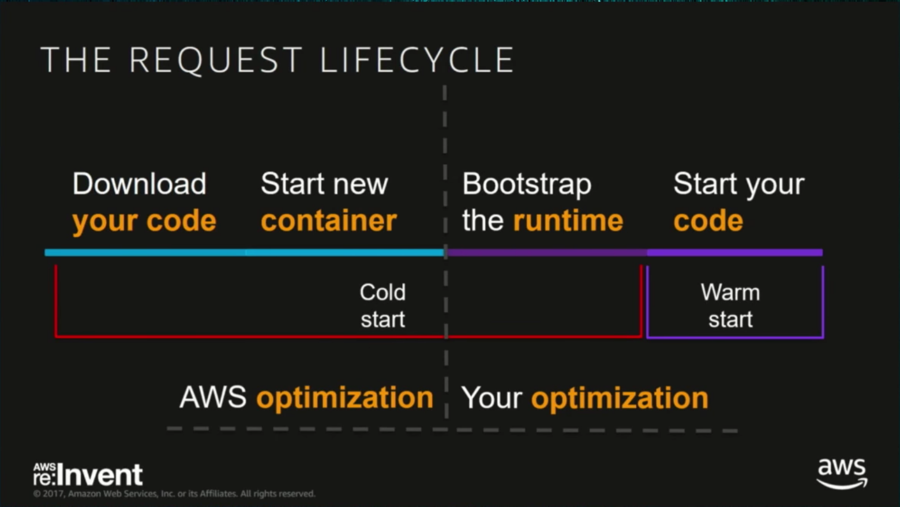

# aws-lambda-pitfalls

我是通过 AWS 认证的专家级解决方案架构师 (AWS Certified Solutions Architect – Professional)，参与开发并维护的 AWS Lambda Function 大概有 30+，这篇文章的目的是讲一讲使用这项技术时遇到的问题，且是这些问题导致我最终转向了 ECS/Fargate 的无服务器化容器技术。

## Prologue

阅读本文，涉及但不限于以下技术名词：
- AWS Services
    - Lambda
    - API Gateway
    - EC2 / Load Balancer
    - Container (eg. Docker)
- Programming Languages
    - NodeJS
    - Golang
- Others
    - http
    - SQL
    - Redis

## TOC

- Pitfalls
    - Concurrency
    - Pricing
    - Long Connection
    - Cold Start
    - External-internet Invocation
    - Async Programming
    - Dessert
- Conclusion

## context.Background() 背景故事

我决定弃用 AWS Lambda，主要是基于这么一件事：

```
                          +-----------------------------+
                          |                             |
+----------------+        |        Api Gateway          |        +---------------------+
|                |        |                             |        |                     |
|     Client     +------->+    AWS Lambda as Adapter    +--------+     Main Service    |
|                |        |                             |        |                     |
+----------------+        +------+------------------+---+        +---------------------+
                                 |                  |
                                 |                  |
                                 |                  |
                     +-----------v------+    +------v-----------+
                     |                  |    |                  |
                     | Plugin Service A |    | Plugin Service B |
                     |                  |    |                  |
                     +------------------+    +------------------+

```

我们现在有一个旧的 Monolithic Application 应用，代码十分臃肿，性能比较低下，为了避免继续在老架构上写新功能，在它的集群前面增加了一个 Adapter，将新业务以plugin的形式作为独立的服务分出去。

最终的目的是将老的服务废掉，整体转移到微服务架构上。

其中，Adapter 部署在了AWS Lambda 上，为了保证性能和可拓展性，它本身不存在任何数据库/缓存的链接，仅做网络请求，属于无状态服务，理论上可以无限横向拓展。

但我首先遇上的就是 Concurrency 和 Pricing 的问题。

## Concurrency

同一个 Lambda Function 在一个时间点内只能处理一个请求。

假如某个时间点内同时来了100个请求，就会出现 100 个 Lambda Function 同时启动的现象。

这一点通过观察 CloudWatch Logs 就很明显，往往有几个 Log Stream，就有几个 Container 启动。

### Account Max Concurrency

首先 Lambda Concurrency 的计算方法和普通的并发计算没有区别。

以 API Gateway + Lambda 的模式举例，在同一个时间内存在多少个请求，就算作多少个 Lambda Concurrency。

而 AWS 给的默认 Max Concurrency 是 1000，如果真的作为 Http 服务来说，1000 的并发量实在是太小了。

例如我们的业务在高峰期最高可以达到 2000 的并发，这就意味着会直接将 AWS 账户指定的 Max Concurrency 打爆，结果就是有很多请求出现 Http Code 429 Too Many Request。

但是在的 EC2 / 容器的架构上，假设 Compute Layer 计算节点可以无限扩容, 并发数基本可以认为是无限的。（这里忽略了DB的限制）

```
+------------+        +---------+        +---------------+
|            |        |         |        |               |
|   Client   +------->+   ELB   +------->+   EC2 / ECS   |
|            |        |         |        |               |
+------------+        +---------+        +---------------+
```

#### Solution 1: Increase it

联系 AWS 的工作人员可以将最大并发数跳高。Global区已有的事例是调高到了10000，但是国区的资源有限，目前最多调整到了2500。

#### Solution 2: Reserved Concurrency

Reserved Concurrency，顾名思义，是为某个 Lambda Function 预留并发数。

避免它太高，会产生上述的 Http Code 429。

同时也避免因为其他无限制的 Lambda Function 占用过多并发导致本服务受到影响。

但是这件事本身是有缺陷的，因为计算资源本身足够，只是因为AWS的限制导致拒绝服务（Low Stability），并不完美。

### How easy to reach account max concurrency ?

假设我们写一个 Lambda 的响应时间是 200ms，只需要用 `ab` 或者随便什么并发工具做一个 5000 并发的测试，就可以轻松观察到 Throttle Error。

## Pricing

AWS Lambda 刚上的时候，市场上基本都是吹声一片，什么无服务器的未来，划时代的技术。

别的不提，至少在价格方面，所有人都以为是十分优惠的。

例如：
- 提供100万个免费请求
- 320 万秒的计算时间免费

但现实并没有这么美好。

### 100ms bill time block

首先，运行不足 100ms 的 Lambda Function 会按照 100ms 计算。

也就意味着，我们花时间优化的代码原本可以在 10ms 内完成任务，却不得不为多余的 90ms 花钱。

### More memory != More cost

这里有个很有趣的事例是，我们的代码在 128MB 的 Lambda 下运行时间是 110ms，但是要花 200ms 的钱。

但假如运行在 256MB 的 Lambda 下，运行时间小于 100ms，只需要计算 100ms 的钱。

以 `0.0000014185¥` / `0.0000028369¥` 的执行价格计算，用大内存的价格和小内存基本一致。

### Not cheap at all

#### Lambda

假设我们的服务
- 每天有 500 万请求 (5,000,000)，一个月即 1.5 亿请求 (150,000,000)
- 每个按 100ms 的计费标准
- 使用的内存是 1024 MB

按照 HK 的价格是: 376.35 USD

#### API Gateway
但是这里还欠缺了 Api Gateway 的部分，由于官方没有提供计算器，以下是我手工粗略计算的价格：

- 每个月前 3.33 亿: 4.675 USD / million

按照 HK 的价格是: 701.25 USD

Lambda + API Gateway: 总计 1077.6 USD

这还没算 CloudWatch Logs 的钱。

#### LB + EC2

我们换回传统的技术算算价格。

##### LB

- 6 GB per Hour
- average 6 new connections per sec
- 1 sec per connection
- average 1000000 requests per second
- average 2 rule evaluation

0.00 USD

##### EC2

- 2 vCPU
- 8 GB
- 2 machines
- Reserved Instances with 1 year term

112.59 USD

Total 112.59 USD

### Conclusion

你可以说这节约了运维成本，至少不用为服务器担忧，但我仍然要说，我用来计算的数据可能是总流量的十分之一，大公司的流量可能是这个的百倍，价格自然不只是以 10 的三次方计算的。

Big Scam !

## Long Connections

### Database Max Connections

假设某个 Lambda Function 有数据库链接的需求，因为我们普遍认为 Lambda 内部均采用同步执行的方式，所以在 sql 的情况下，往往会将 Database Connection (Max/Idle) 设置为 1，避免浪费链接数。

但是和上面的 Max Concurrency 章节结合起来看。假如我们的请求并发数是100，而我们的数据库因为机器开得比较小，最多只能支持50个数据库链接。

这就会导致新启动的 Lambda Function 无法链接到数据库，可能在 main 函数阶段因为无法创建新的数据库链接 (Too Many Connections) 直接退出了。

结果就是，100个请求中有50个请求失败了。

就更别提建立新的数据库链接也是一件非常损耗性能的事了。 

### Compare with EC2 / Container

同样，在 EC2 / Container 的场景下，由于我们会尽量将服务横向拓展的数量及其创建的数据库连接数控制在一个合理的范围内，这句话有点长，总结一下就是我们对扩容遵守以下不等式：

- 服务数 * 服务对数据库的最大连接数 <= 数据库支持的最大连接数

因此，在请求量极大（此时我们假设所有请求都进数据库层了）的时候，编程语言提供的数据库客户端中就处理好了对数据库链接的复用问题，这就意味着，用户的请求在服务中会等待一段时间，直到有可用的数据库链接，才会拿到结果并返回。

可以理解成，牺牲响应时长，以保证服务可靠。

```
+----------+
|          |
|  Client  +----+
|          |    | May Wait
+----------+    |     +-----------------+    +----------------+
                +---->+                 |    |                |
                      |   Web Service   +--->+  SQL Database  |
                +---->+                 |    |                |
+----------+    |     +-----------------+    +----------------+
|          |    | May wait
|  Client  +----+
|          |
+----------+
```

### Some Unproven Suspicions (Only Theory)

AWS Lambda 会在执行完当前方法后，将进程挂起 (Process Hanging)，此时直到新的请求进来，进程才会重新运行。

但是如果了解 TCP 长链接的话 (KeepAlive)，可以提出一个问题，即：当线程挂起时，原先的长链接怎么办？

```
Lambda <--ACK-- Redis
```

比如
- 在 ElastiCache Redis 5.0 中，tcp-keepalive 的参数默认值是 300 (5 min)
    - `The number of seconds the server waits for activity on a non-interactive TCP/IP or UNIX File connection before closing it.`

由于 Lambda Function 容器的生命周期属于不在我们掌控范围之内的东西，它的最大存活时长在 15 min，具体存活时间未知。

这就导致了可能在某段时间后， TCP 链接被数据库关闭了，Lambda 在启动后仍然要再创建一次数据库链接。

这件事是我之前用 Nodejs 实现了一个 APNS 推送时遇到的。

由于 APNS 使用 Http/2 协议实现，会和调用者创建长链接，用于链接复用。

但是时常会发生链接失效的错误。最初以为是第三方库的问题，没有深究，直接把服务从 Lambda 迁移到了 K8s。

后来又有同事用 Go 写了一个类似的实现，也遇到了同样的问题。

最后我怀疑是 KeepAlive 时由于 Lambda 进程挂起，导致无法回复 ACK，从而链接中断。但是对于再次热启动的 Lambda 不知道这件事，自然会发生 Connection Closed 的错误。

这个故事还有另一面，和上面提到的 Concurrency 有关。当请求量大的时候，并发产生了很多 Lambda Container，由于尝试创建太多的链接数，被苹果拒绝服务。

## Cold Start

紧接着前面的内容，Lambda Container 的冷启动时间慢到令人发指。

首先看一下一次冷启动中包含了哪些内容:



更气人的是，Cold Start 部分的钱还得你交。

一些冷启动的时间对比:


作为静态语言的 Go 竟然比不过 Nodejs，简直匪夷所思。我的猜测是，NodeJS/Python 在执行时只需要下载代码部分，体积非常小。但是 Go 需要下载 Binary，体积较大。

当然了，冷启动不止这一点点问题，每次冷启动，在服务里还会对很多其他服务创建链接，比如数据库、缓存、队列，实际上冷启动对性能的损耗绝不止于此。

我们想象一个微服务的架构中，如果以 Lambda 作为服务的基础，在极端情况下，服务间的相互调用如果超过5个，且每个都需要冷启动的话，以 500ms 计算，光是 Runtime 的准备就浪费掉了 2.5s 的时间。

### Solution ? serverless-plugin-warmup

这个插件的目的就是创建一个周期性任务，每隔一段时间向 Lambda 发起指定数量的请求，保证 Container 的存活数量。

但是想把这个插件用好的前提是:
- 预先知道服务的平均并发数

否则 Container 起多了是浪费，起少了又不保险。

比如可能会出现, warmup-plugin和高峰期请求同时发生的情况
- 假如设置了 Reserved Concurrency，则会出现 Http 429
- 假如没设置 Reserved Concurrency，又有可能把数据库链接数打爆

## External-internet Invocation

这个在中国区没什么好说的，通过 SDK 执行 Lambda Function 一定要走一圈外网。

在 Global 区提供了 VPC Endpoint 的功能，修改路由表，请求直接走内网。

同样，API Gateway 近期开通了 Private 模式，即允许通过 VPC 内网直接访问到 API Gateway 的内部地址。

但是由于是修改路由表的模式，对于已有的、通过Http请求而不是 AWS SDK 调用的方式访问 API Gateway 的服务，非常不友好。

一旦在 VPC Endpoint 中开启了 API Gateway 相关的内容，就会造成非Private（即早期的Regional模式）的服务无法访问。

## Async Programming

### Ouroboros


我在 21 世纪初叶的时候写代码用的是 Java/PHP/Python，这些语言作为 Web 服务，不耍花招的话 (eg. epoll, Netty, php-fpm)，这些都属于 "thread per request" 类型，即一个线程对应一个用户的请求，或者称为 "Blocking I/O" 模式。基本原理是请求来了，到了Web服务器如 Apache/Nginx，通过 CGI (Common Gateway Interface) 传输到 Process Manager 上，PM 负责和操作系统内核交互，Fork 或者从线程池中取得一个线程，执行代码，完成请求，释放资源。

```
+-----------+     +--------------+       +------------------+     +-------------+
|           |     |              |  CGI  |                  |     |             |
|  Request  +---->+ Nginx/Apache +------>+  Process Manager +---->+  Your Code  |
|           |     |              |       |                  |     |             |
+-----------+     +--------------+       +------------------+     +-------------+
```

直到2010年左右，NodeJS 大火，号称是 "Non-Blocking I/O"，一个线程能做n个线程的事，吞吐量比传统模式大好几倍。

什么是 "Non-Blocking I/O" 呢，我们可以用一个简单的例子解释一下。

比如我的服务有查询数据库的操作，这个操作耗时100ms，在 "Blocking I/O" 的模式下，这100ms我的线程一直在等数据库的返回结果，什么都没做，也处理不了新的请求。

但是在 "Non-Blocking I/O" 的模式下，“数据库查询”这个操作，会被当作一个 Event，扔进事件队列中，然后 100ms 后，收到数据库完成的通知了，再次触发完成的回调函数。

在这个过程中，假如有新的请求来了，NodeJS 同样会处理这个请求，并且把该做的事扔进事件队列中，直到回调函数被触发，返回给用户对应的结果。


这就是 NodeJS 作为一个单线程语言能够达到极大吞吐量的原因——大部分操作都是异步的，不会卡住等待 I/O 执行完成，而是通过事件机制，在 I/O 操作完成后触发回调函数。

但是这种异步编程的模式同样会遇到困难。比如 NodeJS 最有名的 "Callback Hell"，可能事情没做多少，回调函数的缩进已经写出好几十个空格(或者tab)了，导致代码的可读性变得非常差劲。这件事随着 "Promise" / "Async-Await" 的诞生多少得到了缓解，但问题依然存在。

在近几年，我还用上了 Golang，其中 Goroutine 的轻量级协程概念也能够为服务提供非常强大的性能。我们可以轻而易举的 `go func() {}` 出成百上千的协程，同时响应这么多个请求。

但是 AWS Lambda 的使用如同衔尾蛇一般，把我们带回了传统的 "Blocking I/O" 的时代。Lambda 的理念就是一个函数只做一件事，自然，一个 Lambda 执行只能处理一个请求，上面的 WebServer + MQConsumer 模式自然会被拆成 2 个 Lambda Function。甚至有一些极端的想法是一个 API 接口对应一个 Lambda Function，一个服务假如有10个接口，那就是10个 AWS Lambda。

### What Happens ?

让我不爽的是这种思路无疑破坏了有些语言本身的设计。

比如我们看这么一段代码:

```javascript
exports.handler = async (event) => {
    setTimeout(() => {
        console.log("Lambda Pitfalls");
    }, 0);
};

```

那段 `console.log` 会打印出来吗？

不会，因为 NodeJS 的 Event Loop 还没轮到 `setTimeout` 执行，整个 `handler` 函数就已经执行完毕，线程被 Lambda 本身挂起了。

再比如在 Go 里我们可能会这么写

```golang
func requestHandler(w http.ResponseWriter, r *http.Request) {
    go sendMQ("Lambda Pitfalls")

    w.Write([]byte("ok"))
}

func sendMQ(s string) {
    fmt.Println(s)
}
```

那段 "Lambda Pitfalls" 会被打印出来吗？不一定。

因为 `Handler` 函数外的所有代码都会在 `Handler` 执行完毕后挂起。

假如你还认为 Lambda 会以你认为的语言本身的方式执行的话，是一定会出问题的。

比如

- 在 Go Http-Server 中经常用到的 Middleware 概念，可能我们在其中做了很多异步的操作，例如 OpenTracing / Sentry / Prometheus / MQ，这些操作会不会被执行，什么时候被执行，一切都成了未知数。

- 如果读过 Go 的官方库 `database/sql/sql.go` 的话，就会知道线程被强行挂起是件多可怕的事情了:
  - 使用过的 connection 可能不会被回收
  - 失败的事务可能不会被回滚

```golang
// database/sql/sql.go:711
func OpenDB(c driver.Connector) *DB {
    // ...

    // Runs in a separate goroutine, opens new connections when requested.
    go db.connectionOpener(ctx)
    // connectionResetter runs in a separate goroutine to reset connections async
    // to exported API.
    go db.connectionResetter(ctx)

    return db
}

```

## Dessert

上面的内容比较复杂，最后说一点轻松的，当作主菜后的甜点。

### Timezone

和 Linux 不同，我们可以在打镜像的时候就设置好机器的时区，不需要单独处理。

但 AWS Lambda 使用的是 UTC 时区，并且无法被修改，所以一定要在代码里处理时区问题。

### Content-Length

这是一个 API Gateway + Lambda 组合时遇到的问题。

在 Lambda 中使用 http-server 时，可以设置 Header 的 Content-Length，但是该 Header 并不会被认真对待。

真正返回给客户端的 Content-Length Header 会被 API Gateway 接管，即在 Lambda 中返回的长度是多少，就会是多少。

这在多数时间里是一件好事，但是在从 AWS Lambda 向容器技术迁移服务的时候，曾经困扰了我相当长的一段时间。本来我以为在代码里写 Content-Length 挺对的，结果 Nginx 处在内容还没传输完直接把请求掐了，一度让我觉得是 AWS LB 的锅，查了很久。

### Binary Base64 Encoding

另一个 API Gateway + Lambda 组合的问题。

由于 Lambda 和 API Gateway 之间的通信可以认为是 JSON 格式，比如我的服务器返回了一个 Excel 文件，那么这个文件的内容是一定会被 Encode Base64 并以字符串的形式写进JSON的。

这就导致了 API Gateway 对客户端的返回结果从希望的 Binary 变成了 Base64，令人头大。

只有在 API Gateway Settings 里规定某些 Content-Type 需要以 Binary 的方式处理，API Gateway 才能正确处理这部分内容。

### SQS/Kinesis Consumer

Lambda 作为 SQS/Kinesis Consumer 时有一个特殊的设定，即如果 `Handler` 函数没有返回错误，AWS会帮忙把已经消费的消息从队列/流中删除。

但有时候我们的需求并没有这么简单。假如有十条消息，其中成功处理了九条，有一条需要重试，我的函数应该返回什么呢？

- 不返回 error: 失败的消息也被删除了，无法重试
- 返回 error: 成功的消息也会被重试

非常尴尬。

最终的选择不多，要么：

- 新建消息发送到 SQS/Kinesis 用于重试
- 手动删除成功的消息，并返回错误
- 保证方法幂等，即使消息重试也不会出问题

## Conclusion

以上提到的问题基本上绝了我继续使用 AWS Lambda 的想法，已经将目前还在维护的项目全部迁移到了 ECS/Fargate 上。

但这只是我个人的选择，并不意味着 AWS Lambda 完全不能用。甚至我认为在某些特定的场景下，使用 AWS Lambda 会带来极大的便利。

比如：

### 和 AWS 服务的集成

AWS Lambda 有非常好的和 AWS 其他服务的集成，基本上所有服务都可以产生 Event 由 Lambda 来消费。（有 Push/Pull 两种模式，这里不详细解释了）

最简单的例子就是对 SQS/Kinesis/CloudWatchEvent/DynamoDBStream 这些事件的消费。由于这些 Event 背后基本上都是些轻量级的事件，所以用 Lambda 做异步处理非常方便。

例如在 SQS 可以由 AWS 接手横向拓展，会随着队列中挤压的消息数量，增加 SQS Consumer 并行的数量。

例如 对 Kinesis 的流式数据处理往往需要记录处理的位置 (Positioning，和 Kafka/Parcel 等可重放的队列消费基本一样)，在 Java 中 AWS 提供了 KCL (Kinesis Client Library) 自动帮助处理，但是例如 Go 等其他语言则没有这个东西。

由 AWS Lambda 托管的 Kinesis Consumer 则能够很好的处理这件事。

### Web 前端的 SSR (Server-Side Render)

Web 前端的 SSR 是一件非常吃 CPU 的事，我记得我们的前端刚发新版用上 SSR 的时候，一度因为流量太大，打爆了集群的 CPU。

使用 AWS Lambda 就可以忽略对基础设施的依赖，最多就是把 Concurrency 打爆。

但是要记得将内存调至 1024M，让 NodeJS 能够独占一个 vCPU，不然性能的差距还是很大的。

### 快速的 POC (Proof Of Concept)

这是个和产品经理勾心斗角时候常用的技巧。对方提了个需求，我们对将来的使用情况，有多少流量完全一无所知。这种情况下不如将服务部署在 API Gateway + Lambda 上观察一段时间。如果量特别小，不调用也不会花钱；如果量特别大，就将服务迁移到容器上，比如 K8S / Fargate。

不过现在我观察到一些趋势——对 API Gateway + Lambda 模式的深度依赖。例如使用 API Gateway 提供的 Custom Authorizer 方法验证用户身份，放入 Context 中，传到下一步 Lambda Function。

在你可以预知服务的并发数/请求数时，这么做不是什么大问题，因为将来不太会涉及到迁移的问题。

假如对将来一无所知，最好还是保证自身代码的 Portability （可迁移性），否则一旦发生 AWS Lambda 超限、无法解决的问题，是没法做到快速、安全地迁移的。

写代码、做服务，很多人认为是写完了，能跑，这事就算完了。但这往往是最最基础的部分，真正的挑战还没开始呢。

### ECS/Fargate, EKS(AWS 托管的 K8S)

我觉得 Serverless (无服务器化) 的将来应该是像 Fargate 一样，做服务的人提供容器镜像等一系列资源参数，不用操心机器的事，只需要知道我的服务应该跑多少个，并且在监控数据达到百分之多少的时候扩容就好了。

这也是我将服务全部迁移到 Fargate 的原因。

同样，EKS也可以做类似的事情，区别在于在 EKS 中，只需要由专业的运维管理 K8S 的 worker node 即可，不用操心 K8S Master / ETCD 等节点的事。

两个技术各有千秋。

例如:

- EKS Worker Node 可以购买 AWS Reserved Instance (RI) 套餐，能极大节约机器的成本
- EKS Worker Node 还可以给机器打镜像，这就意味着可以在操作系统的基础上增加定制化的配置，如 rsyslog 日志收集，如 jaeger-agent 的链路追踪收集等等
- EKS 美中不足就是无法和 Fargate 集成，依然还需要对集群进行管理

不过这部分并不是本文的主要内容，就不继续写了。

## References
- https://calculator.aws/#/createCalculator
- https://aws.amazon.com/cn/api-gateway/pricing/
- https://redis.io/topics/benchmarks
- https://aws.amazon.com/cn/blogs/database/best-practices-for-configuring-parameters-for-amazon-rds-for-mysql-part-3-parameters-related-to-security-operational-manageability-and-connectivity-timeout/
- https://www.youtube.com/watch?v=oQFORsso2go&feature=youtu.be&t=8m5s
- https://levelup.gitconnected.com/aws-lambda-cold-start-language-comparisons-2019-edition-%EF%B8%8F-1946d32a0244
- https://www.jeremydaly.com/reuse-database-connections-aws-lambda/
- https://nodejs.org/zh-cn/docs/guides/event-loop-timers-and-nexttick/
- https://medium.com/@bohou/understanding-nodejs-event-loop-without-a-computer-science-degree-e1c9250d583f